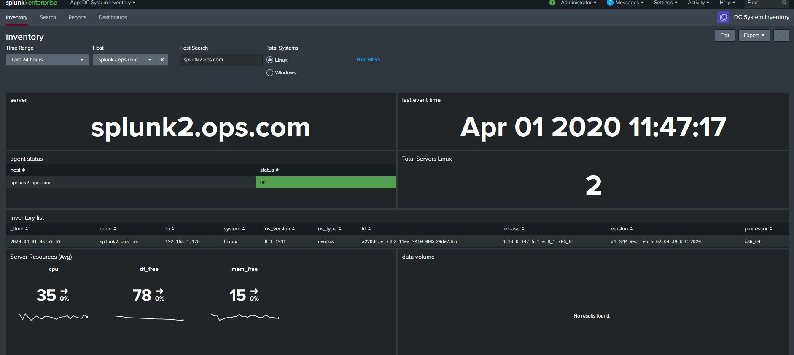

System Inventory

This apps provides way to listing your assets

It uses a python script, which runs on the server, the output sends the data to the Splunk index, so you can use this with the free version of Splunk and it wont cost anything. You can also use it in a production enviroment, but keep a check on the volume of servers, I have only tested this in a small enviroment.

For this app, I have set the polling for every once a day at 12:00 day, afte this a saved search will run at 01:00am and push the data into a kv store. The KV store is used for tables and is much faster.

The dashboard will also provide some stats on server resources, if you are collecting server metrics data, if not then its ok no data will be shown.

The python script in the app will generate event data into a file which contains, a unique host id, node name, ip address, system type, processor information, it will then use a look up for for Linux OS types.

Dashboard Features:

- inventory list
- agent status
- last event
- total systems
- data volume
- server resources - (basic cpu, mem, disk avg)

Application Features:

Provides Server Inventory Information, great for tracking assets

Data Config:
- Event Data
- data kept for 14 days
- index=inventory
- index size = 100MB

Python Script for Data:-
- dc_os_inventory_v0.5.py

Requirements:
- UF agent running on the target node
- DC_inventory App
- Splunk 7.1 + (Metrics Workspace)
- TA-linux-metrics (optional)
- Linux Server Running Splunk 7.1 X on AIO or SH
- Python 3 installed on the target servers (Windows Linux) used to collect system inventory data

Install:

This app should be installed on a Search Head for dashboards, or All in one Splunk instance. The indexes.conf file needs to be deployed to the indexing layer, if its a distributed architecture. The DC_inventory deployed to the Linux or Windows taregt servers where the script will run and collect the system data. The target systems will need to have python installed. Optionally the linux-metrics can be deployed to the target Linux servers to collect metric data. Windows Metric collection was not setup at the time, but will be looked at in the future, but this can be easly done via various apps from Splunkbase.

This app was only tested on Splunk instance running on Linux.

Download the zip and extract the file, copy the DC_inventory folder to the Splunk Server
sudo cp -R DC_linux_monitoring /opt/splunk/etc/apps
sudo chown -R splunk:splunk /opt/splunk/etc/apps
sudo -u splunk /opt/splunk/bin/splunk restart

Optionaly use the TA-linux-metrics to collect metrics data, see my Linux Monitoring app for details on git.  

Config:

The polling collection can be adjusted in the inputs.conf in the DC_inventory app, the data will be sent to index=inventory, this can be changed if required.

You will need to run chmod +x for the python  scripts to run /bin/scripts

Update the lookupcsv file to reflect your Linux servers types and releases, as each enviroment has different flavours and versions.

lookup file = linuxos_versions.csv

Use:
Login to Splunk and go DC_inventory, you should see the dashboards, select the target server of interest and should see data.

